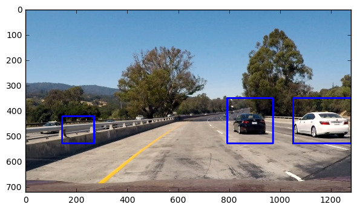

# SelfDrivCar-VehicleDetection

The steps of this project are as follows:  

* Compute the camera calibration matrix and distortion coefficients given a set of chessboard images.
* Apply the distortion correction to the raw image.  
* Use color transforms, gradients, etc., to create a thresholded binary image.
* Apply a perspective transform to rectify binary image ("birds-eye view"). 
* Detect lane pixels and fit to find lane boundary.
* Determine curvature of the lane and vehicle position with respect to center.
* Warping the detected lane boundaries back onto the original image.
* Output visual display of the lane boundaries and numerical estimation of lane curvature and vehicle position.
* Run the entire pipeline on a sample video.

# Please look at the video output at 
https://www.youtube.com/watch?v=wcQMWtootdU&list=PL7OdKZN5JSqvrvCWj4cX7J3dtac83Tw5U&index=2

